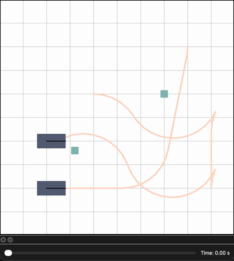

# Prioritized Hybrid-A* Path Planner

> by [Jeeho Ahn](https://github.com/jeeho-ahn) (jeeho@umich.edu)

## Quick Summary

Implementation of Multi-Robot Hybrid A* path planner with priority on previously planned agent paths.

# Overview
This repository contains a demonstration of a *Prioritized Hybrid A\* (PHA\*)* path planner implemented in C++. The planner is designed for multi-robot systems with dynamic environments, incorporating prioritized planning, collision avoidance, and object transfer capabilities. It uses a hybrid approach combining discrete grid search with continuous Reeds-Shepp curves for efficient non-holonomic path generation.

The demo simulates robots navigating a 2D grid while avoiding obstacles and other entities, with optional object pickup and transfer. Visualization is powered by Qt, allowing interactive playback of trajectories over time.

Key components:
- **Path Planning**: Prioritized Hybrid A* with analytic expansion using Reeds-Shepp paths.
- **Collision Detection**: SAT (Separating Axis Theorem) for rectangle intersections.
- **Time Management**: TimeTable for spatio-temporal trajectory management.
- **Entities**: Robots and objects with kinematic constraints.

## Features

- **Multi-Robot Planning**: Supports sequential planning for multiple robots with prioritization.
- **Object Transfer**: Robots can "transfer" objects (e.g., push or carry) with adjusted kinematics.
- **Dynamic Environments**: Accounts for moving entities via time-indexed collision checks.
- **Visualization**: Qt-based GUI with a timeline slider to scrub through simulation time.
- **Reeds-Shepp Integration**: Analytic paths for smooth, curvature-constrained motion (adapted from [PythonRobotics](https://github.com/AtsushiSakai/PythonRobotics/blob/master/PathPlanning/ReedsSheppPath/reeds_shepp_path_planning.py)).
- **Customizable Parameters**: Grid resolutions, penalties (e.g., reverse, turn), safety margins, etc.

## Dependencies

- **C++ Standard**: C++11 or later.
- **Qt**: Version 5 or 6 (for visualization). Required modules: QtWidgets, QtGui.
- **Standard Libraries**: `<chrono>`, `<unordered_map>`, `<vector>`, etc. (no external dependencies beyond Qt).
- **Compiler**: GCC, Clang, or MSVC with C++11 support.

No additional libraries like Boost or Eigen are required.

## How to run

After building the CMake project, run PHAstar_demo binary (from PHAstar_demo.cpp).

## Project Structure

- `PHAstar_push_demo.cpp`: Main entry point and demo logic.
- `PHAstar.h`: Core Hybrid A* planner implementation.
- `Reeds_Shepp.h`: Reeds-Shepp path generation (adapted from PythonRobotics).
- `Visualization.h`: Qt-based visualization widget.
- `TimeTable.h`: Manages timed poses and trajectories.
- `Entities.h`: Definitions for robots, objects, poses, etc.
- `Params.h`: Configuration parameters.
- `Point.h`: Basic point and corner utilities.
- `Utils.h`: Math utilities (e.g., mod2pi).

## Citation
> This planner is developed as a part of an upcoming research work. Stay tuned for the publication!

## License

This project is licensed under the MIT License - see the [LICENSE](LICENSE) file for details.

## Contact

- Author: Jeeho Ahn
- Email: jeeho@umich.edu
- GitHub: [jeeho-ahn](https://github.com/jeeho-ahn)

If you encounter issues or have questions, open an issue on GitHub.