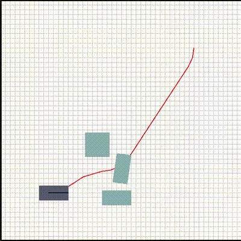

# Prioritized Hybrid-A*

> by [Jeeho Ahn](https://github.com/jeeho-ahn) (jeeho@umich.edu)

## Description

Implementation of Hybrid A* path planner with priority on previously planned agent paths.

## Requirements
- CMake
- Qt version 5 or 6 (for visualization)

## How to run

After building the CMake project, run PHAstar_demo binary (from PHAstar_demo.cpp).

## License

This project is licensed under the MIT License